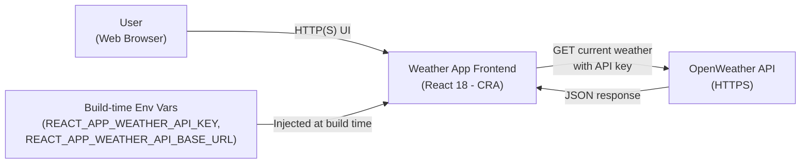
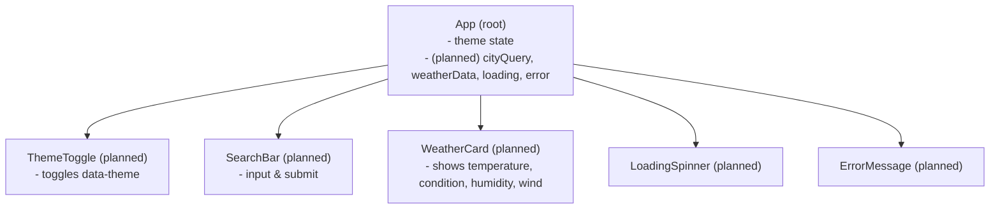
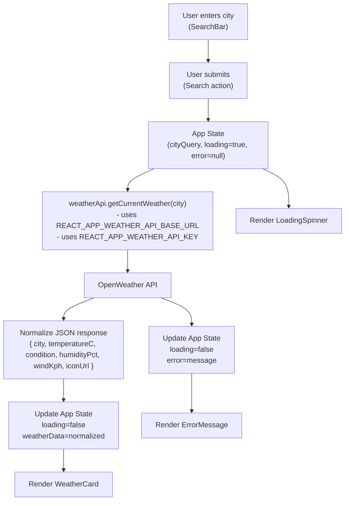
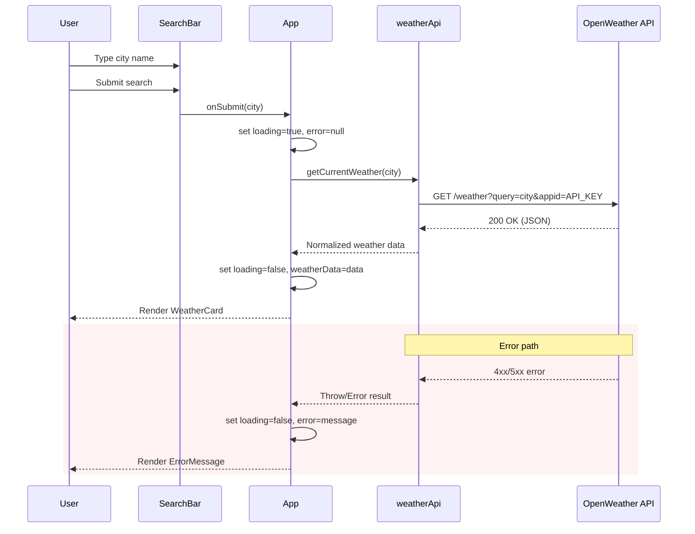
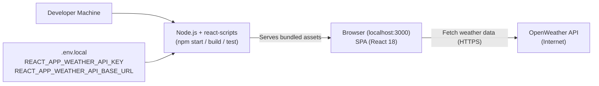

# Weather App Frontend - Diagrams

## System Context Diagram
The frontend is a single-page React application running in the browser. It communicates with a third-party weather API (e.g., OpenWeather) over HTTPS using an API key provided via CRA environment variables at build time.

## Component Hierarchy
Initial implementation has a single App component with theming. Planned components are shown for weather functionality, keeping state local to App and using hooks.

## Data Flow for Weather Lookup
This shows the one-way data flow from user input to the rendered view, with environment variables used by the service at build time.

## Sequence Diagram for User Search
A sequence showing user interaction, component behavior, and the external API call.

## Deployment Diagram (Development)
Local development setup using CRA with react-scripts, environment variables loaded via .env.local.

## Notes
- The application remains a single-page CRA app without routing.
- Environment variables must be prefixed with REACT_APP_ to be available at build time.
- All network calls are performed client-side from the browser to the OpenWeather API over HTTPS.
